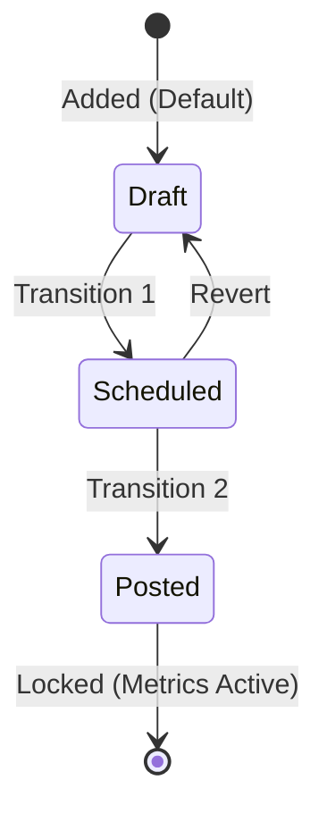

# Social Media Content Planner & Performance Reporter

An easy-to-digest technical and operational guide for the Social Media Content Planner project. This project is a command-line interface (CLI) tool designed to manage social media posts, track post lifecycle status, record engagement metrics, and compile performance reports.

---

## 🛠️ Project Structure & Architecture

The application is structured as a single-executable Python CLI utility that leverages plain-text flat files as its persistent database layer.

### Directory Layout

*   [planner.py](file:///c:/Users/Administrator/Documents/Final%20Project/planner.py) — Core application entry point, containing data handlers, validation logic, CLI menus, and business logic.
*   [test_planner.py](file:///c:/Users/Administrator/Documents/Final%20Project/test_planner.py) — Unit test suite verifying platform/post loading, data schema integrity, and report compilation.
*   [platforms.txt](file:///c:/Users/Administrator/Documents/Final%20Project/platforms.txt) — Flat-file database storing details of target platforms.
*   [posts.txt](file:///c:/Users/Administrator/Documents/Final%20Project/posts.txt) — Flat-file database storing post ideas, captions, schedules, and lifecycle status.
*   [engagement.txt](file:///c:/Users/Administrator/Documents/Final%20Project/engagement.txt) — Flat-file database storing likes, comments, shares, and views for published posts.

---

## 📊 Database & Data Schemas

The database uses pipe-delimited (`|`) values to separate fields. Data is read, updated, and saved sequentially.

### 1. Platforms Schema (`platforms.txt`)
Stores the available channels and their current follower counts.
*   **Format**: `Platform ID|Platform Name|Follower Count`
*   **Example**:
    ```text
    P1|Instagram|12500
    P2|TikTok|45000
    P3|X|8200
    ```

### 2. Posts Schema (`posts.txt`)
Tracks post attributes, scheduling dates, and their publishing status.
*   **Format**: `Post ID|Platform Name|Content Caption|Scheduled Date|Status`
*   **Example**:
    ```text
    POST001|Instagram|Check out our new project launch!|2026-08-01|Scheduled
    POST002|TikTok|A day in the life of a computer science student|2026-07-10|Posted
    ```

### 3. Engagement Schema (`engagement.txt`)
Stores raw metric logs for posted content to compute performance summaries.
*   **Format**: `Post ID|Likes|Comments|Shares|Views`
*   **Example**:
    ```text
    POST002|1200|85|45|15000
    POST003|150|12|8|850
    ```

---

## 🔄 Post Status Lifecycle

Posts navigate through three main states. Status logic prevents recording metrics until a post reaches the terminal `Posted` state.



> [!NOTE]
> Metrics can *only* be logged for posts with a `Posted` status. Attempts to log engagement for `Draft` or `Scheduled` statuses are blocked.

---

## 🚀 Core Functionalities & Workflows

### ➕ 1. Add Post Idea
*   Validates uniqueness of `Post ID`.
*   Forces target platform selection from the curated list in `platforms.txt`.
*   Sanitizes input to disallow the pipe delimiter (`|`) in content captions.
*   Enforces date validation in `YYYY-MM-DD` format.
*   Sets status to `Draft` by default.

### 🔄 2. Update Post Status
*   Performs transitions between `Draft`, `Scheduled`, and `Posted`.
*   Updates the file representation in `posts.txt`.

### 📈 3. Record Engagement Metrics
*   Restricted to posts in `Posted` state.
*   Prompts and validates non-negative integers for Likes, Comments, Shares, and Views.
*   Saves/updates records in `engagement.txt`.

### 📅 4. Display Content Calendar
*   Retrieves all post logs.
*   Sorts posts chronologically by scheduled date.
*   Prints formatted tables featuring a truncated caption preview.

### 🗑️ 5. Delete Post Idea
*   Triggers cascading deletion: removing the post from `posts.txt` automatically triggers the cleanup of matching metrics in `engagement.txt` to keep the database consistent.

### 📊 6. Performance Report Generation & Export
*   Computes:
    1.  **Total Posts Per Platform**: Post count breakdown across channels.
    2.  **Best-Performing Post**: Found by maximizing interaction sum (Likes + Comments + Shares + Views).
    3.  **Top Platform**: The channel yielding the highest combined interaction points.
*   Offers CLI output summary or export as a text report to `report.txt`.

---

## 🧪 Testing & Verification

The suite contains tests validation using Python's built-in `unittest` library.

To run the verification suite, execute the following command in the project directory:
```bash
python -m unittest test_planner.py
```

### Covered Test Cases:
*   `test_load_platforms` — Ensures target channels load correctly with correct structures.
*   `test_load_posts` — Confirms post data is structured properly.
*   `test_load_engagement` — Verifies engagement parsing functions.
*   `test_report` — Validates the performance report calculations (ranking algorithms, platform counting, best post identification).
