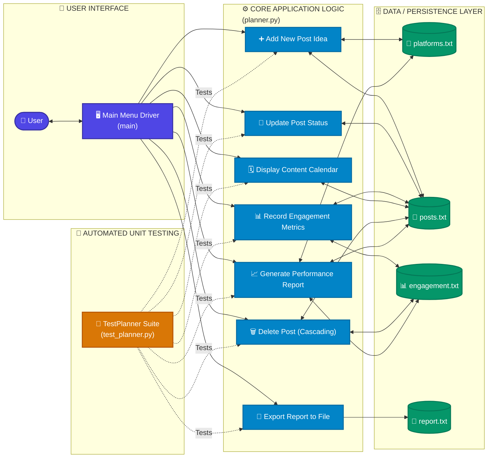
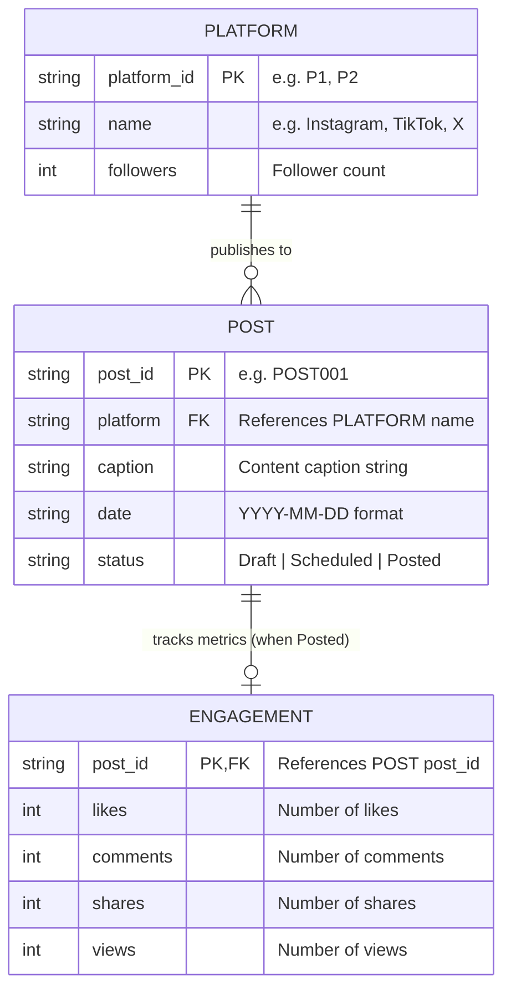
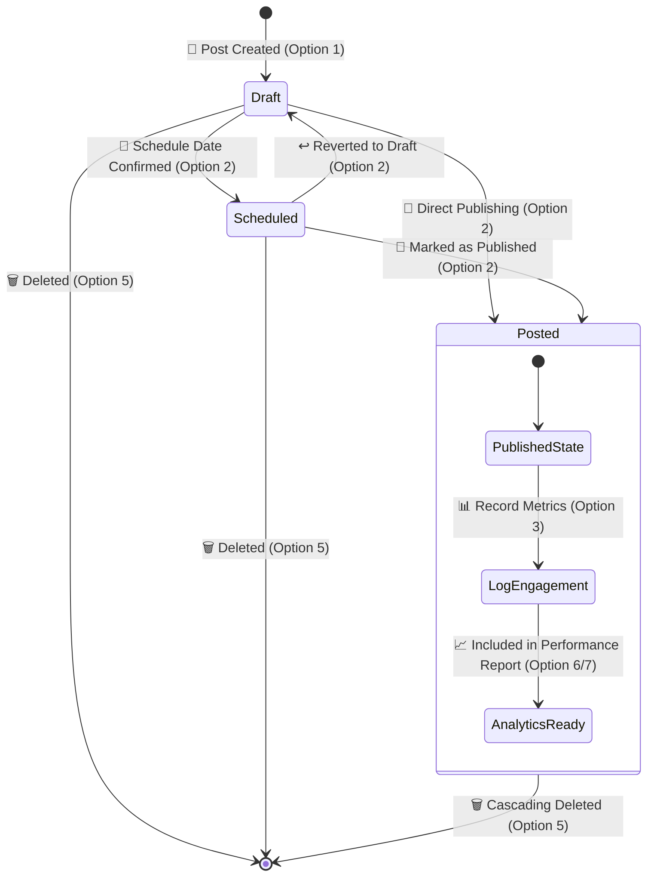
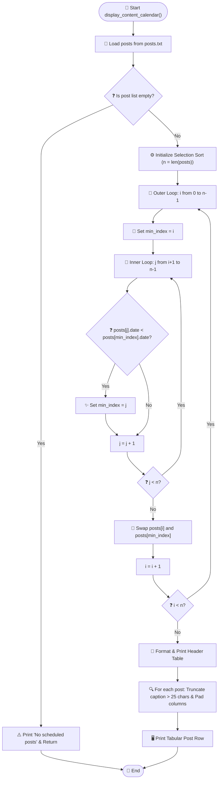
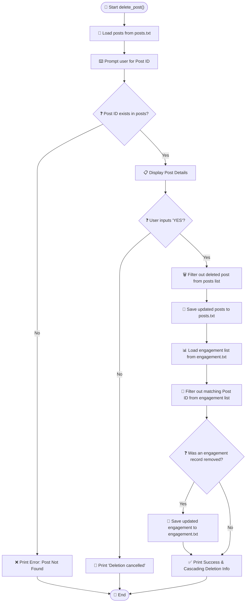

# 📱 Social Media Content Planner — Comprehensive Source Code Documentation

A command-line interface (CLI) application developed in Python for content creators, marketing managers, and social media strategists to plan post ideas, track publication statuses, record engagement metrics, display sorted content calendars, and generate performance reports.

---

## 📌 Table of Contents
1. [🏛️ System Architecture & Design Overview](#%EF%B8%8F-system-architecture--design-overview)
2. [📂 Directory & Repository Structure](#-directory--repository-structure)
3. [🗄️ Data Storage & Flat-File Schemas](#%EF%B8%8F-data-storage--flat-file-schemas)
4. [🔄 Post Lifecycle & State Machine](#-post-lifecycle--state-machine)
5. [⚙️ Detailed Function Documentation (`planner.py`)](#%EF%B8%8F-detailed-function-documentation-plannerpy)
   - [💾 File Handling & Persistence Functions](#-file-handling--persistence-functions)
   - [🔍 Validation Helper Functions](#-validation-helper-functions)
   - [🎯 Core Application Features](#-core-application-features)
   - [📈 Analytics & Reporting Functions](#-analytics--reporting-functions)
   - [🖥️ Main Application Driver](#%EF%B8%8F-main-application-driver)
6. [🔀 Algorithmic Flowcharts](#-algorithmic-flowcharts)
   - [🗓️ Selection Sort Content Calendar Workflow](#%EF%B8%8F-selection-sort-content-calendar-workflow)
   - [🗑️ Cascading Deletion Workflow](#%EF%B8%8F-cascading-deletion-workflow)
7. [🧪 Unit Testing Suite (`test_planner.py`)](#-unit-testing-suite-test_plannerpy)
8. [🛠️ Installation & Execution Guide](#%EF%B8%8F-installation--execution-guide)

---

## 🏛️ System Architecture & Design Overview

The Social Media Content Planner is designed as a standalone Python CLI application. It relies entirely on Python standard library modules (`os`, `datetime`, `unittest`), requiring no third-party package installations.

### 🌟 Key Architectural Principles:
* ⚡ **Zero External Dependencies**: Uses native file I/O operations (`open()`, `read()`, `write()`) and custom parsing logic.
* 💾 **Flat-File Persistence**: Stores application state in pipe-delimited (`|`) text files (`platforms.txt`, `posts.txt`, `engagement.txt`).
* 🛡️ **Defensive Validation & Integrity**: Validates input syntax manually (date format validation, non-negative integers, disallowing delimiter characters in text) and guarantees referential integrity through cascading deletion.
* 🧮 **Custom Algorithmic Logic**: Implements an in-memory Selection Sort algorithm for sorting content calendar entries by date without relying on external sorting libraries.

### 📊 High-Level Architecture Diagram


```mermaid
flowchart LR

    %% =========================
    %% Style Definitions
    %% =========================
    classDef ui fill:#4f46e5,stroke:#3730a3,color:#ffffff,stroke-width:2px;
    classDef core fill:#0284c7,stroke:#0369a1,color:#ffffff,stroke-width:2px;
    classDef storage fill:#059669,stroke:#047857,color:#ffffff,stroke-width:2px;
    classDef test fill:#d97706,stroke:#b45309,color:#ffffff,stroke-width:2px;

    %% =========================
    %% Swimlane 1: User Interface
    %% =========================
    subgraph UI["👤 USER INTERFACE"]
        direction TB
        User(["👤 User"]):::ui
        Menu["🖥️ Main Menu Driver<br/>(main)"]:::ui

        User <--> Menu
    end

    %% =========================
    %% Swimlane 2: Core Logic
    %% =========================
    subgraph Core["⚙️ CORE APPLICATION LOGIC<br/>(planner.py)"]
        direction TB

        AddPost["➕ Add New Post Idea"]:::core
        UpdateStatus["🔄 Update Post Status"]:::core
        RecordEng["📊 Record Engagement Metrics"]:::core
        ShowCal["🗓️ Display Content Calendar"]:::core
        DelPost["🗑️ Delete Post (Cascading)"]:::core
        Report["📈 Generate Performance Report"]:::core
        Export["📄 Export Report to File"]:::core
    end

    %% =========================
    %% Swimlane 3: Data Layer
    %% =========================
    subgraph Data["🗄️ DATA / PERSISTENCE LAYER"]
        direction TB

        PlatformsFile[("📱 platforms.txt")]:::storage
        PostsFile[("📝 posts.txt")]:::storage
        EngFile[("📊 engagement.txt")]:::storage
        ReportFile[("📄 report.txt")]:::storage
    end

    %% =========================
    %% Swimlane 4: Automated Testing
    %% =========================
    subgraph Testing["🧪 AUTOMATED UNIT TESTING"]
        direction TB

        UnitTestSuite["🧪 TestPlanner Suite<br/>(test_planner.py)"]:::test
    end

    %% =========================
    %% UI → Core Logic
    %% =========================
    Menu --> AddPost
    Menu --> UpdateStatus
    Menu --> RecordEng
    Menu --> ShowCal
    Menu --> DelPost
    Menu --> Report
    Menu --> Export

    %% =========================
    %% Core Logic → Data Layer
    %% =========================
    AddPost <--> PlatformsFile
    AddPost <--> PostsFile

    UpdateStatus <--> PostsFile

    RecordEng <--> PostsFile
    RecordEng <--> EngFile

    ShowCal <--> PostsFile

    DelPost <--> PostsFile
    DelPost <--> EngFile

    Report <--> PlatformsFile
    Report <--> PostsFile
    Report <--> EngFile

    Export --> ReportFile

    %% =========================
    %% Testing → Core Logic
    %% =========================
    UnitTestSuite -.->|"Tests"| AddPost
    UnitTestSuite -.->|"Tests"| UpdateStatus
    UnitTestSuite -.->|"Tests"| RecordEng
    UnitTestSuite -.->|"Tests"| ShowCal
    UnitTestSuite -.->|"Tests"| DelPost
    UnitTestSuite -.->|"Tests"| Report
    UnitTestSuite -.->|"Tests"| Export
```

---

## 📂 Directory & Repository Structure

```text
CSC1024-Final-Project-main/
├── 📊 engagement.txt     # Persistent storage for engagement metrics (likes, comments, shares, views)
├── 📜 LICENSE            # MIT Software License file
├── ⚙️ planner.py         # Main source code containing core business logic, UI main menu, & file I/O
├── 📱 platforms.txt      # Persistent storage for available social media platforms and follower counts
├── 📝 posts.txt          # Persistent storage for scheduled and drafted content posts
├── 📑 readme.md          # Comprehensive technical documentation with Mermaid.js diagrams & emojis
└── 🧪 test_planner.py    # Unit test suite validating data loading and performance reporting logic
```

---

## 🗄️ Data Storage & Flat-File Schemas

The application uses custom pipe-delimited (`|`) text files for persistent storage.

### 📐 Entity-Relationship Diagram


```mermaid
erDiagram
    PLATFORM {
        string platform_id PK "e.g. P1, P2"
        string name "e.g. Instagram, TikTok, X"
        int followers "Follower count"
    }
    
    POST {
        string post_id PK "e.g. POST001"
        string platform FK "References PLATFORM name"
        string caption "Content caption string"
        string date "YYYY-MM-DD format"
        string status "Draft | Scheduled | Posted"
    }
    
    ENGAGEMENT {
        string post_id PK, FK "References POST post_id"
        int likes "Number of likes"
        int comments "Number of comments"
        int shares "Number of shares"
        int views "Number of views"
    }

    PLATFORM ||--o{ POST : "publishes to"
    POST ||--o| ENGAGEMENT : "tracks metrics (when Posted)"
```

### 📋 File Schemas Breakdown

#### 1. 📱 Platforms File (`platforms.txt`)
Stores registered social media platforms.
* **Format**: `Platform ID|Platform Name|Follower Count`
* **Example**:
  ```text
  P1|Instagram|12500
  P2|TikTok|45000
  P3|X|8200
  ```

#### 2. 📝 Posts File (`posts.txt`)
Stores content ideas and scheduled post entries.
* **Format**: `Post ID|Platform Name|Content Caption|Scheduled Date|Status`
* **Allowed Statuses**: `Draft`, `Scheduled`, `Posted`
* **Example**:
  ```text
  POST001|Instagram|Check out our new project launch!|2026-08-01|Scheduled
  POST002|TikTok|A day in the life of a computer science student|2026-07-10|Posted
  POST003|X|Excited to share that we are starting our final programming project today!|2026-07-09|Posted
  POST004|Instagram|Sneak peek of the new UI design!|2026-08-05|Draft
  ```

#### 3. 📊 Engagement Metrics File (`engagement.txt`)
Stores performance metrics for published (`Posted`) content.
* **Format**: `Post ID|Likes|Comments|Shares|Views`
* **Example**:
  ```text
  POST002|1200|85|45|15000
  POST003|150|12|8|850
  ```

---

## 🔄 Post Lifecycle & State Machine

Posts transition through strict state rules managed by `update_post_status()`.


```mermaid
stateDiagram-v2
    [*] --> Draft : 📝 Post Created (Option 1)
    
    Draft --> Scheduled : 📅 Schedule Date Confirmed (Option 2)
    Draft --> Posted : 🚀 Direct Publishing (Option 2)
    
    Scheduled --> Draft : ↩️ Reverted to Draft (Option 2)
    Scheduled --> Posted : 🚀 Marked as Published (Option 2)
    
    state Posted {
        [*] --> PublishedState
        PublishedState --> LogEngagement : 📊 Record Metrics (Option 3)
        LogEngagement --> AnalyticsReady : 📈 Included in Performance Report (Option 6/7)
    }
    
    Draft --> [*] : 🗑️ Deleted (Option 5)
    Scheduled --> [*] : 🗑️ Deleted (Option 5)
    Posted --> [*] : 🗑️ Cascading Deleted (Option 5)
```

---

## ⚙️ Detailed Function Documentation (`planner.py`)

### 💾 File Handling & Persistence Functions

#### 📱 `load_platforms()`
* **Purpose**: Reads `platforms.txt` and returns a list of platform dictionaries.
* **Return Type**: `list[dict]` (Keys: `platform_id`, `name`, `followers`)

#### 📝 `load_posts()`
* **Purpose**: Reads `posts.txt` and loads all post records into memory.
* **Return Type**: `list[dict]` (Keys: `post_id`, `platform`, `caption`, `date`, `status`)

#### 💾 `save_posts(posts)`
* **Purpose**: Writes the in-memory list of post dictionaries back to `posts.txt`.

#### 📊 `load_engagement()`
* **Purpose**: Reads `engagement.txt` and loads post engagement records.
* **Return Type**: `list[dict]` (Keys: `post_id`, `likes`, `comments`, `shares`, `views`)

#### 💾 `save_engagement(engagement_list)`
* **Purpose**: Saves updated engagement records to `engagement.txt`.

---

### 🔍 Validation Helper Functions

#### 📅 `get_valid_date(prompt)`
* **Purpose**: Interactively prompts and validates user input for calendar dates (`YYYY-MM-DD`). Supports `'cancel'` abort.

#### 🔢 `get_non_negative_int(prompt)`
* **Purpose**: Prompts the user for numeric metrics and validates non-negative integer values (`.isdigit()`).

---

### 🎯 Core Application Features

#### ➕ `add_new_post_idea()` (Option 1)
* **Purpose**: Interactive workflow to add a new content draft with validation for unique ID, platform matching, caption delimiter checks, and valid dates.

#### 🔄 `update_post_status()` (Option 2)
* **Purpose**: Manages state transitions (`Draft` $\rightarrow$ `Scheduled`/`Posted`; `Scheduled` $\rightarrow$ `Posted`/`Draft`).

#### 📊 `record_engagement_metrics()` (Option 3)
* **Purpose**: Logs performance metrics (likes, comments, shares, views) for published content (`status == "Posted"`).

#### 🗓️ `display_content_calendar()` (Option 4)
* **Purpose**: Renders a formatted tabular calendar of posts sorted by date via Selection Sort.

#### 🗑️ `delete_post()` (Option 5)
* **Purpose**: Removes a post from `posts.txt` and sweeps matching records from `engagement.txt` (cascading delete).

---

### 📈 Analytics & Reporting Functions

#### 📊 `compile_performance_report_data()`
* **Purpose**: Aggregates statistics: posts count per platform, best-performing post by max interaction score ($\sum \text{likes, comments, shares, views}$), and most interactive platform.

#### 🖥️ `generate_performance_report()` (Option 6)
* **Purpose**: Prints summary performance report to stdout.

#### 📄 `export_report_to_file()` (Option 7)
* **Purpose**: Writes formatted performance report summary with timestamp to `report.txt`.

---

### 🖥️ Main Application Driver

#### 🚪 `main()` (Option 8 / Program Loop)
* **Purpose**: Entry point driver function running the main menu interface loop (options 1–8).

---

## 🔀 Algorithmic Flowcharts

### 🗓️ Selection Sort Content Calendar Workflow


```mermaid
flowchart TD
    Start(["🚀 Start display_content_calendar()"]) --> Load["📝 Load posts from posts.txt"]
    Load --> CheckEmpty{"❓ Is post list empty?"}
    
    CheckEmpty -- Yes --> PrintEmpty["⚠️ Print 'No scheduled posts' & Return"] --> End(["🏁 End"])
    CheckEmpty -- No --> InitSort["⚙️ Initialize Selection Sort (n = len(posts))"]
    
    InitSort --> OuterLoop["🔄 Outer Loop: i from 0 to n-1"]
    OuterLoop --> SetMin["📌 Set min_index = i"]
    SetMin --> InnerLoop["🔄 Inner Loop: j from i+1 to n-1"]
    
    InnerLoop --> Compare{"❓ posts[j].date < posts[min_index].date?"}
    Compare -- Yes --> UpdateMin["✨ Set min_index = j"] --> IncJ["j = j + 1"]
    Compare -- No --> IncJ
    
    IncJ --> CheckInner{"❓ j < n?"}
    CheckInner -- Yes --> InnerLoop
    CheckInner -- No --> Swap["🔀 Swap posts[i] and posts[min_index]"]
    
    Swap --> IncI["i = i + 1"]
    IncI --> CheckOuter{"❓ i < n?"}
    CheckOuter -- Yes --> OuterLoop
    CheckOuter -- No --> Render["🎨 Format & Print Header Table"]
    
    Render --> FormatLoop["🔍 For each post: Truncate caption > 25 chars & Pad columns"]
    FormatLoop --> DisplayTable["🖥️ Print Tabular Post Row"]
    DisplayTable --> End
```

---

### 🗑️ Cascading Deletion Workflow


```mermaid
flowchart TD
    Start(["🚀 Start delete_post()"]) --> LoadPosts["📝 Load posts from posts.txt"]
    LoadPosts --> PromptID["⌨️ Prompt user for Post ID"]
    PromptID --> SearchPost{"❓ Post ID exists in posts?"}
    
    SearchPost -- No --> ErrorMsg["❌ Print Error: Post Not Found"] --> End(["🏁 End"])
    SearchPost -- Yes --> DisplayPost["📋 Display Post Details"]
    
    DisplayPost --> Confirm{"❓ User inputs 'YES'?"}
    Confirm -- No --> CancelMsg["🚫 Print 'Deletion cancelled'"] --> End
    
    Confirm -- Yes --> FilterPosts["🗑️ Filter out deleted post from posts list"]
    FilterPosts --> SavePosts["💾 Save updated posts to posts.txt"]
    
    SavePosts --> LoadEng["📊 Load engagement list from engagement.txt"]
    LoadEng --> SweepEng["🧹 Filter out matching Post ID from engagement list"]
    
    SweepEng --> CheckCascade{"❓ Was an engagement record removed?"}
    CheckCascade -- Yes --> SaveEng["💾 Save updated engagement to engagement.txt"] --> PrintSuccess["✅ Print Success & Cascading Deletion Info"]
    CheckCascade -- No --> PrintSuccess
    
    PrintSuccess --> End
```

---

## 🧪 Unit Testing Suite (`test_planner.py`)

The test suite validates data ingestion and analytics calculation functions using Python's native `unittest` runner.

### 📊 Test Cases Breakdown

| Test Method | Description | Assertions & Validation Criteria |
| :--- | :--- | :--- |
| 📱 `test_load_platforms` | Validates platform initialization | Verifies platform list length $> 0$ and first entry name equals `"Instagram"`. |
| 📝 `test_load_posts` | Validates post parsing | Verifies post list length $> 0$ and first entry ID equals `"POST001"`. |
| 📊 `test_load_engagement` | Validates engagement data parsing | Verifies engagement list length $> 0$. |
| 📈 `test_report` | Validates statistical aggregation logic | Checks platform counts (`Instagram: 2`, `TikTok: 1`, `X: 1`) and verifies `POST002` total interaction count equals `16330`. |

---

## 🛠️ Installation & Execution Guide

### 📦 Prerequisites
* Python 3.6 or higher installed on your system.

### ▶️ Running the Application
To launch the interactive CLI program:
```bash
python planner.py
```

### 🧪 Running Unit Tests
To execute the automated unit test suite:
```bash
python -m unittest test_planner.py
```
